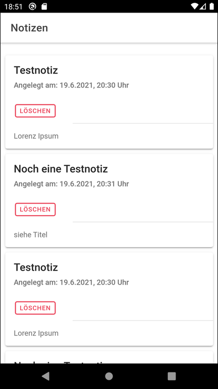
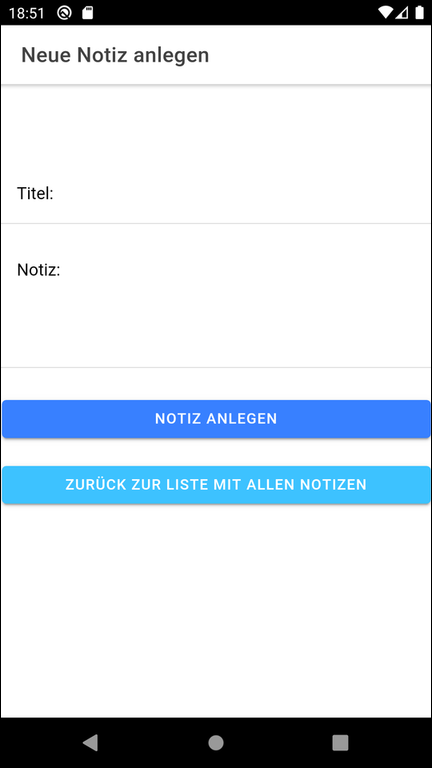

# Storing notes in Firestore #

<br>

Simple Ionic using [Firestore](https://firebase.google.com/docs/firestore/) (NoSQL database offered by [Google Firebase](https://firebase.google.com/)) to store personal notes.
For integration of Firebase functionaliy [Angular Fire](https://github.com/angular/angularfire) is used.
All the Firebase-specific code is contained in [class `FirebaseService`](src/app/firebase.service.ts).

<br>

----

## Screenshots ##

<br>

    

<br>

----

## Firebase Configuration ##

For the time being the "old" version 8.6.1 of the [Firebase library](https://www.npmjs.com/package/firebase) is used because of [this issue](https://github.com/angular/angularfire/issues/2838#issuecomment-858208215).

<br>

Create a Firebase project.

Enable "Email address and password" as "sign-in method" under "Authentication".

For *Firestore* the following rule has to be configured (see also [this answer on SO](https://stackoverflow.com/a/55115937)):
```
rules_version = '2';
service cloud.firestore {
  match /databases/{database}/documents {
    match /notizensammlung/{nutzer_uid} {
    
      function istAngemeldet() {
            return request.auth.uid != null;
      }
      allow read  : if istAngemeldet() && request.auth.uid == resource.data.nutzer_uid;
      allow create: if istAngemeldet() && request.auth.uid == request.resource.data.nutzer_uid;
      allow delete: if istAngemeldet() && request.auth.uid == resource.data.nutzer_uid;
    }
  }  
}
```

<br>

Create an index on collection `notizensammlung` for the following fields:
* `nutzer_uid` ascending
* `zeitstempel` ascending

<br>

----

## License ##

See the [LICENSE file](LICENSE.md) for license rights and limitations (BSD 3-Clause License) for the files in this repository.

<br>
